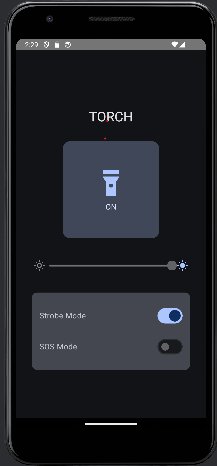

# TorchApp
A simple yet powerful Torch App built with Kotlin and Jetpack Compose that provides multiple flashlight modes  
✅ Normal Light Mode – Toggle the flashlight ON/OFF.  
✅ Dimming Mode – Adjust brightness (for supported devices)  
✅ SOS Mode – Sends an SOS distress signal using Morse code  
✅ Strobe Mode – Blinking light with adjustable frequency  

## 🚀 Features  
- Modern Jetpack Compose UI  
- Torch control using Camera2 API  
- Adjustable brightness for supported devices  
- SOS emergency signal  
- Strobe effect with adjustable speed  
- Material Design 3 styling  

## 🛠 Tech Stack  
- Kotlin  
- Jetpack Compose  
- Camera2 API (Torch control)  
- Coroutines & Flow (For async operations)  
- ViewModel & State Management  

## 📸 Screenshots  
### 🔦 Torch App Main Screen  
  

## 📝 To-Do List  
 - Add Widget support for quick flashlight access  
 - Implement gesture control for modes  
 - Improve UI animations  
